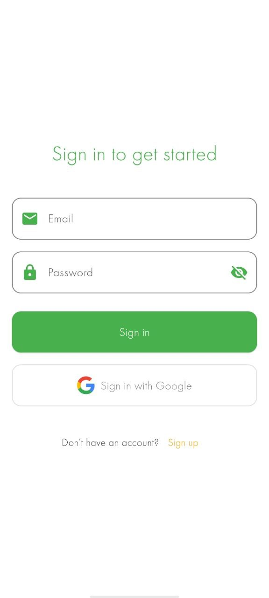
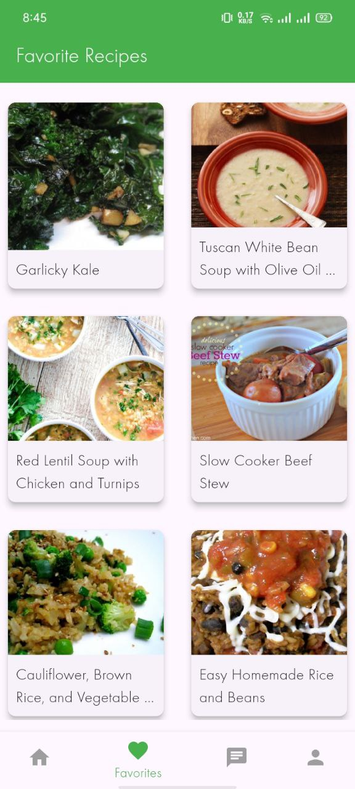

# Recipe App 🍽️

An interactive mobile app to discover, explore, and save your favorite recipes. Built with **Flutter**, integrated with **Firebase**, and powered by **AI-based recipe suggestions**.

## Features ✨

1. **User Authentication**

   - Email-password login and sign-up.
   - Google sign-in for quick access.

2. **Recipe Discovery**

   - Search recipes by name or ingredients.
   - Explore recipes by category.
   - View all recipes when no filter is applied.

3. **Detailed Recipe Information**

   - Get comprehensive details about each recipe:
     - Ingredients
     - Step-by-step instructions
     - Course type, cuisine, preparation time, and more
     - Beautifully designed images for better visualization

4. **Favorites Management**

   - Add recipes to your favorites list.
   - Cloud storage for favorites—sync and retrieve favorites across devices.

5. **AI-Powered Suggestions**
   - Get personalized recipe suggestions based on the ingredients you have.

## Screenshots 📸

  
  
  

  
  
  

  
  

## Tech Stack 🛠️

- **Frontend Framework:** [Flutter](https://flutter.dev/)
- **Backend Services:** [Firebase](https://firebase.google.com/)
  - Authentication
  - Firestore Database
- **AI Integration:** Gemini API for personalized recipe generation
